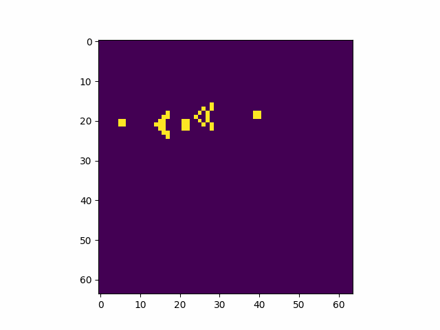

# Game of Life



## Description 🐜
This is a simple implementation of The Game of Life in Python. In the notebook you can find the game description, logic, and a few simple examples. I also included basic functions that allow you to immediately experiment with common patterns, such as Blocks, Blinkers, Gliders and so on.

## Basic usage 🤖
This is how you create an empty world, populate with simple patterns, run the game loop, and obtain the final animation in git format.

<pre>
```python
# Create empty grid of size 64 x 64
w1 = get_empty_world(64,64)

# Instantiate a glider gun at coordinates (20, 5)
gosper_glider_gun((20,5),w1)

# Instantiate a bunch of other structures
blinker((20,43), world)
lwss((10,30), world)

# Run the game loop for 200 epochs
history = game_loop(200, w1)

# Generate the animation (saved in out forder)
generate_animation(history, 'gosper_gun')
```
</pre>

## Thanks 
Feel free to use, modify and expand the code to meet your needs. Have fun 😊

